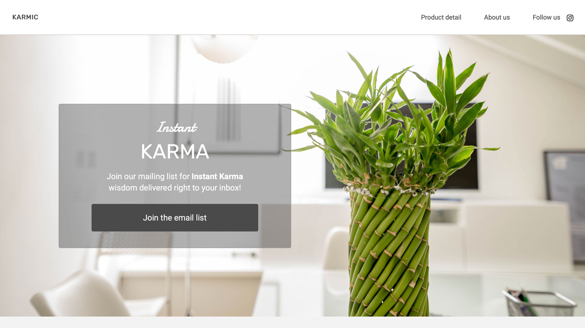

<h1><a href="https://labmandala.github.io/instant-karma/"><strong>Instant Karma</strong></a></h1>

A Front-End Engineer project for Responsive Website Development.

<h4>Challenges Involved:</h4>

* Independent Problem Solving
* CSS Documentation & Research
* Code Debugging to fix bugs

With careful inspection and use of Chrome DevTools, I was able to fix a broken version of a website and update the site's CSS according to specifications.
Once the bugs were fixed and the basic structure was in place, I then implemented an original updated theme design with hover effects, JavaScript code snippet, and alternative features to improve user experience.

<h4>Features Include:</h4>

* Cohesive User Interface Design
* An Expanded Image Collage Gallery
* Teams Section with Sliding Carousel
